# Domain Class Diagram

This diagram is based on the current Java files under `src/domain`.

It focuses on the domain relationships that matter for controller and persistence design:

- product design and approval
- subscription and contract issuance
- accident, claim, investigation, assessment, and payment
- coverage, rider, provision, exclusion, and premium calculation
- domain-list objects that bridge domain objects and DAO persistence

```mermaid
classDiagram
direction LR

class Money {
  -long amount
  -String currency
}

class Product {
  -String productId
  -String productCode
  -String productName
  -ProductStatus status
  -Target target
  -LineOfBusiness lineOfBusiness
  -Date saleStartDate
  -Date saleEndDate
  +design()
  +applyForApproval()
  +applySalePermit()
  +onsale()
  +validateOnSale()
}

class ProductCoverage {
  -String productCoverageId
  -String productId
  -String coverageMasterId
  -String coverageName
  -CoverageType coverageType
  -boolean mandatory
}

class ProductRider {
  -String productRiderId
  -String productId
  -String riderId
  -String riderCode
  -String riderName
  -Double discountRate
}

class ProductDocument {
  -String productDocumentId
  -String productId
  -DocType docType
  -String title
  -String filename
  -Date submittedAt
  -Date receivedAt
}

class ProductStatus {
  <<enumeration>>
  DESIGNING
  DESIGN_COMPLETE
  KIDI_SUBMITTED
  KIDI_CONFIRMED
  FSS_APPLIED
  FSS_APPROVED
  FILING
  FILED
  SALE_PENDING
  ON_SALE
  SALE_EXPIRED
  DISCONTINUED
}

class Target {
  <<enumeration>>
  INDIVIDUAL
  CORPORATE
}

class LineOfBusiness {
  <<enumeration>>
  AUTO
}

Product "1" o-- "*" ProductCoverage
Product "1" o-- "*" ProductRider
Product "1" o-- "*" ProductDocument
Product --> ProductStatus
Product --> Target
Product --> LineOfBusiness

class Coverage {
  -String coverageId
  -String coverageName
  -CoverageType coverageType
  -Deductible deductible
  -Money limitAmount
  -LimitType limitType
  -LimitUnit limitUnit
  -boolean mandatory
}

class CoverageLimitOption {
  -String coverageMasterId
  -int optionId
  -String optionName
}

class CoverageLimitDetail {
  -int detailId
  -int optionId
  -int amount
  -DetailType detailType
}

class Deductible {
  -Money amount
  -Double rate
  -DeductibleType type
}

class StandardProvisions {
  -String standardProvisionId
  -String title
  -String description
}

class Exclusion {
  -String exclusionId
  -String exclusionName
  -String description
}

class Rider {
  -String riderId
  -String riderCode
  -String riderName
  -RiderType riderType
  -Double discountRate
  -boolean mandatory
}

class CoverageType {
  <<enumeration>>
}

class LimitType {
  <<enumeration>>
  FIXED
  UNLIMITED
  PER_OCCURRENCE
}

class LimitUnit {
  <<enumeration>>
  KRW
  PERCENT
}

class RiderType {
  <<enumeration>>
}

Coverage "1" o-- "*" CoverageLimitOption
Coverage "1" o-- "*" StandardProvisions
Coverage "1" o-- "*" Coverage
Coverage --> Deductible
Coverage --> CoverageType
Coverage --> LimitType
Coverage --> LimitUnit
Coverage --> Money
CoverageLimitOption "1" o-- "*" CoverageLimitDetail
StandardProvisions "1" o-- "*" Exclusion
Rider --> RiderType

class Subscription {
  -String subscriptionNo
  -String userId
  -String applicantName
  -String ssn
  -String address
  -String carNumber
  -String chassisNumber
  -String productName
  -Money premium
  -Money basePremium
  -Date subscriptionDate
  -SubscriptionStatus status
  -String rejectReason
  +register()
  +approve()
  +reject()
  +requestSupplement()
}

class SubscriptionStatus {
  <<enumeration>>
}

class Contract {
  -String contractId
  -String policyNo
  -String productId
  -String productName
  -String subscriptionNo
  -ContractStatus status
  -Money premium
  -Party policyholder
  -Party namedInsured
  -Insured insured
  -Product product
}

class ContractStatus {
  <<enumeration>>
}

class Party {
  -String partyId
  -String name
  -String ssn
  -String phone
  -String address
  -Role role
  +calcAge()
}

class Insured {
  -String insuredId
  -String insuredName
  -InsuredType insuredType
  -Money insuredValue
}

class Car {
  -String carId
  -String carNumber
  -String owner
  -String driver
  -DriverScope driverScope
  -Model model
  -CarPurpose purpose
}

class Model {
  -String modelId
  -String modelName
  -ModelType modelType
  -Date modelYear
  -int engineCC
  -FuelType fuelType
  -String manufacturer
}

class DriverScope {
  -int minAge
  -ScopeType scopeType
  -Party familyMember
  -String familyMemberInfo
}

class CarPurpose {
  <<enumeration>>
}

Contract --> ContractStatus
Contract --> Product
Contract --> Money
Contract --> Party
Contract --> Insured
Contract "1" o-- "*" SelectedCoverage
Contract "1" o-- "*" SelectedRider
Subscription --> SubscriptionStatus
Subscription --> Money
Car --|> Insured
Car --> DriverScope
Car --> Model
Car --> CarPurpose
DriverScope --> Party

class SelectedCoverage {
  -String coverageMasterId
  -String coverageName
  -CoverageType coverageType
  -Money basePremium
  -Money deductibleAmount
  -Money limitAmount
  -boolean mandatory
}

class SelectedRider {
  -String riderId
  -String riderCode
  -String riderName
  -double discountRate
}

SelectedCoverage --> CoverageType
SelectedCoverage --> Money

class Accident {
  -String accidentId
  -String userId
  -Date accidentDate
  -String accidentLocation
  -String reportedBy
  -String phone
  -AccidentStatus status
  -String contractId
  -Money coverageLimit
  -Money expectedRepairCost
  -AccidentType accidentType
  -SeverityLevel severityLevel
  +report()
}

class Claim {
  -String claimId
  -Accident accident
  -String claimantName
  -Date claimDate
  -String contractId
  -ClaimStatus claimStatus
  -ClaimType claimType
  -String assignedEmployee
  -DamageInvestigation damageInvestigation
  +assess()
  +completePayment()
}

class ClaimDocument {
  -String documentId
  -String documentName
  -String filePath
  -Date uploadDate
  -boolean verified
}

class DamageInvestigation {
  -String investigationId
  -String accidentId
  -String claimId
  -String investigatorName
  -Date investigationDate
  -double liabilityRatio
  -DamageAssessment assessment
  -InjuryGrade injuryGrade
  -Money expectedRepairCost
  -Money compensationLimit
}

class DamageAssessment {
  -Money settlement
  -Money deductibleAmount
  -Money compensationAmount
  -ClaimPayment claimPayment
}

class ClaimPayment {
  -String bankName
  -String accountNumber
}

class AccidentStatus {
  <<enumeration>>
}

class AccidentType {
  <<enumeration>>
}

class SeverityLevel {
  <<enumeration>>
}

class ClaimStatus {
  <<enumeration>>
}

class ClaimType {
  <<enumeration>>
}

class InjuryGrade {
  <<enumeration>>
}

Accident --> AccidentStatus
Accident --> AccidentType
Accident --> SeverityLevel
Accident --> Money
Claim --> Accident
Claim --> ClaimStatus
Claim --> ClaimType
Claim --> DamageInvestigation
ClaimDocument --> Claim
DamageInvestigation --> DamageAssessment
DamageInvestigation --> InjuryGrade
DamageInvestigation --> Money
DamageAssessment --> Money
DamageAssessment --> ClaimPayment

class CreditInfo {
  -String applicantName
  -String ssn
  -String carNumber
  -List~AccidentRecord~ accidentHistory
  -int drivingExperienceYears
  -String creditGrade
  -String fraudHistory
}

class RiskAnalysisReport {
  -String subscriptionNo
  -double riskScore
  -int riskGrade
  -double surchargeRate
  -Money basePremium
  -Money surchargeAmount
  -Money totalPremium
  -String reviewGuide
  -String reviewerName
  -Date reviewDate
}

class PremiumCalculation {
  -long subtotal
  -double discountRate
  -long discountAmount
  -long finalPremium
  +calculate()
}

class ProfitabilityCalculator {
  +profit()
  +bep()
}

CreditInfo --> Money
RiskAnalysisReport --> Money
PremiumCalculation --> CarPurpose

class Employee {
}

class FieldInvestigator {
  -String employeeId
  -String name
  -String specialty
  -int openCaseCount
}

Employee *-- FieldInvestigator

class User {
  -String userId
  -String password
  -String name
  -UserRole role
  -String ssn
}

class UserRole {
  <<enumeration>>
}

User --> UserRole

class ProductList {
  -ProductDao dao
  -List~Product~ products
}

class SubscriptionList {
  -SubscriptionDao dao
  -List~Subscription~ subscriptions
}

class ContractList {
  -ContractDao dao
  -List~Contract~ contracts
}

class AccidentList {
  -AccidentDao dao
  -List~Accident~ accidents
}

class ClaimList {
  -ClaimDao dao
  -List~Claim~ claims
}

class CoverageList {
  -CoverageDao dao
  -List~Coverage~ coverages
}

class RiderList {
  -RiderDao dao
  -List~Rider~ riders
}

class RiskAnalysisReportList {
  -RiskAnalysisReportDao dao
  -List~RiskAnalysisReport~ reports
}

class DamageInvestigationList {
  -DamageInvestigationDao dao
  -List~DamageInvestigation~ investigations
}

class FieldInvestigatorList {
  -EmployeeDao dao
  -List~FieldInvestigator~ investigators
}

class UserList {
  -UserDao dao
}

ProductList o-- Product
SubscriptionList o-- Subscription
ContractList o-- Contract
AccidentList o-- Accident
ClaimList o-- Claim
CoverageList o-- Coverage
RiderList o-- Rider
RiskAnalysisReportList o-- RiskAnalysisReport
DamageInvestigationList o-- DamageInvestigation
FieldInvestigatorList o-- FieldInvestigator
UserList ..> User
```

## Notes

The `*List` classes are part of the domain package, but they also act as persistence-facing collection services. They hold DAO dependencies and convert between VO objects and domain objects.

`MasterController` currently bypasses some of these list objects for master-data CRUD. That is a documented exception, not the preferred pattern for new workflow controllers.
